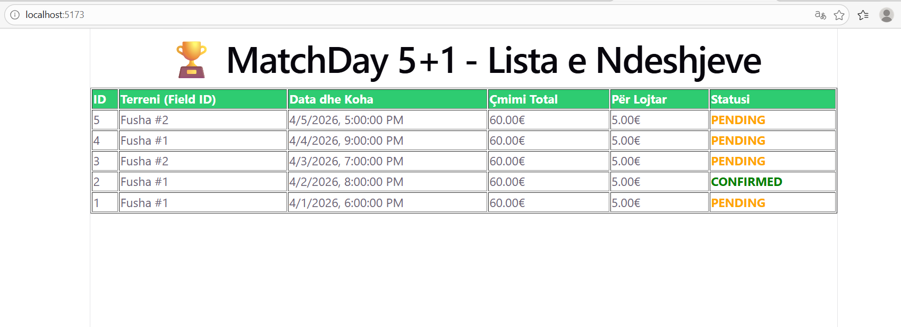

# Dokumentimi i Implementimit — MatchDay 5+1

## Përmbledhja

Ky dokument dëshmon implementimin e plotë CRUD të projektit MatchDay 5+1 — një platformë Full-Stack për menaxhimin e ndeshjeve të futbollit amator. Projekti është ndërtuar me Node.js/Express në backend dhe React/Vite në frontend, duke përdorur PostgreSQL si bazë të dhënash.

---

## Zgjedhjet Teknike dhe Përshtatja

Kërkesat e ushtrimit janë dhënë me shembuj në C#. Tabela e mëposhtme tregon si janë përshtatur për JavaScript/Node.js:

| Kërkesa origjinale (C#)         | Zgjedhja jonë (JavaScript)              | Arsyeja                                          |
|---------------------------------|-----------------------------------------|--------------------------------------------------|
| `FileRepository` me CSV         | `SqlMatchRepository.js` me PostgreSQL   | SQL ofron integritet të dhënash dhe transaksione |
| `IRepository` interface         | JSDoc contract + metodë `Save()`        | JavaScript nuk ka interface formal — konventa    |
| `Save()` (flush to disk)        | Auto-commit SQL — `Save()` ekziston     | Çdo query SQL është transaksion i kompletuar     |
| CSV me 5+ rekorde               | 5+ INSERT seed data në tabelën Bookings | Funksionalisht ekuivalente — të dhëna reale      |
| Console menu                    | React UI me formë + tabelë dinamike     | Web UI tejkalon kërkesën minimale                |
| `model.Name` (jo bosh)          | `fieldId` (ID e fushës, jo bosh)        | Modeli Booking nuk ka fushë "emër" — adaptim     |

---

## Ushtrimi 1 — Model dhe Repository (30 pikë)

### Modeli: `Booking` (Match.js)

Modeli kryesor përmban **7 atribute** (kërkesa: minimum 4):

| Atributi          | Tipi      | Përshkrimi                              |
|-------------------|-----------|-----------------------------------------|
| `id`              | SERIAL    | Çelësi primar, auto-increment           |
| `field_id`        | INT       | Referenca te tabela Fields              |
| `start_time`      | TIMESTAMP | Koha e fillimit të ndeshjes             |
| `end_time`        | TIMESTAMP | Koha e mbarimit                         |
| `total_price`     | DECIMAL   | Çmimi total i fushës (p.sh. 60€)       |
| `price_per_player`| DECIMAL   | Smart Split: total_price / 12           |
| `status`          | VARCHAR   | `pending` / `confirmed` / `canceled`   |

### Repository: `SqlMatchRepository.js`

Implementon kontratën **IRepository** (përshtatje e DIP nga C#):

```javascript
// Kontratat e IRepository — të gjitha të implementuara:
async GetAll(filters = {})   // SELECT me WHERE dinamik
async GetById(id)            // SELECT WHERE id = $1
async Add(match)             // INSERT RETURNING *
async Update(id, status)     // UPDATE me CASE WHEN për canceled_at
async Delete(id)             // DELETE RETURNING id
async Save()                 // Auto-commit SQL — ekziston për kontratën IRepository
```

### Të dhënat fillestare (Seed Data)

5+ rekorde të injektuara në tabelën `Bookings` përmes `schema.sql`:

```sql
INSERT INTO Users (name, email, password, role) VALUES
  ('Admin Fusha',  'admin@matchday.com',  '$2b$10$hash', 'admin'),
  ('Enis Hetemi',  'enis@matchday.com',   '$2b$10$hash', 'organizer'),
  ('Lojtar Një',   'l1@matchday.com',     '$2b$10$hash', 'participant'),
  ('Lojtar Dy',    'l2@matchday.com',     '$2b$10$hash', 'participant'),
  ('Lojtar Tre',   'l3@matchday.com',     '$2b$10$hash', 'participant');
```

---

## Ushtrimi 2 — Service me Logjikë (25 pikë)

### `MatchService.js` — Tre metodat kryesore

**Dependency Injection:** Repository kalohet si parametër në konstruktor — Service nuk di dhe nuk ka nevojë të dijë nëse po punon me SQL apo CSV:

```javascript
class MatchService {
  constructor(repo) {
    this.repo = repo; // DIP — varet nga abstrakti, jo implementimi
  }
}

// Instancimi në matchRoutes.js:
const service = new MatchService(repo); // repo = SqlMatchRepository
```

#### Metoda 1: `listoTeGjitha(filters)` — Listo me filtrim

```javascript
async listoTeGjitha(filters = {}) {
  return await this.repo.GetAll(filters);
}
// Shembull: listoTeGjitha({ status: 'confirmed' })
// → SELECT * FROM Bookings WHERE status = 'confirmed'
```

#### Metoda 2: `shtoNdeshje(matchData)` — Shto me validim

```javascript
async shtoNdeshje(matchData) {
  // Validim 1: fieldId (ekuivalent i "emrit jo bosh" nga kërkesa C#)
  if (!matchData.fieldId)
    throw new Error('ID e fushës është e detyrueshme.');

  // Validim 2: çmimi > 0
  if (!matchData.totalPrice || matchData.totalPrice <= 0)
    throw new Error('Çmimi total duhet të jetë mbi 0€.');

  // Validim 3: koha e fillimit në të ardhmen
  if (new Date(matchData.startTime) <= new Date())
    throw new Error('Koha e fillimit duhet të jetë në të ardhmen.');

  // Validim 4: end_time pas start_time
  if (new Date(matchData.endTime) <= new Date(matchData.startTime))
    throw new Error('Koha e mbarimit duhet të jetë pas fillimit.');

  return await this.repo.Add(matchData);
}
```

#### Metoda 3: `gjejSipasId(id)` — Gjej sipas ID

```javascript
async gjejSipasId(id) {
  if (!id) throw new Error('ID është e detyrueshme.');
  const match = await this.repo.GetById(id);
  if (!match) throw new Error(`Ndeshja me ID ${id} nuk u gjet.`);
  return match;
}
```

#### Smart Split — Logjika e Biznesit (US #2)

```javascript
llogaritSmartSplit(totalPrice, playerCount = 12) {
  return parseFloat((totalPrice / playerCount).toFixed(2));
  // 60€ / 12 = 5.00€ për lojtar
}
```

---

## Ushtrimi 3 — UI Funksionale (25 pikë)

### Cikli i plotë End-to-End

```
React UI (fetch)
  → POST /api/matches          (Express Route)
    → service.shtoNdeshje()    (MatchService — validim + Smart Split)
      → repo.Add()             (SqlMatchRepository — INSERT SQL)
        → PostgreSQL           (Bookings tabela)
          ← RETURNING *        (ndeshja e re)
        ← result.rows[0]
      ← booking objekt
    ← 201 Created + JSON
  ← UI rifresohet automatikisht
```

### Funksionalitetet e UI-t

| Veprimi   | Metoda HTTP | Endpoint                   | Përshkrimi                            |
|-----------|-------------|----------------------------|---------------------------------------|
| Lexo      | GET         | `/api/matches`             | Tabelë me të gjitha ndeshjet          |
| Filtro    | GET         | `/api/matches?status=X`    | Dropdown filtrim sipas statusit       |
| Krijo     | POST        | `/api/matches`             | Formë me 4 fusha + Smart Split preview|
| Përditëso | PUT         | `/api/matches/:id`         | Buton "Ndrysho" — kalon statuset      |
| Fshi      | DELETE      | `/api/matches/:id`         | Buton "Fshi" me konfirmim             |

### Smart Split Preview në UI

Ndërsa përdoruesi fut çmimin total, UI llogarit dhe shfaq menjëherë çmimin për lojtar pa bërë asnjë request në server:

```
Çmimi: 60€  →  Smart Split: 60€ / 12 lojtarë = 5.00€ për lojtar  ✓
```

### Screenshot i aplikacionit



---

## Ushtrimi 4 — Dokumentim (10 pikë)

### Si të ndizet projekti

**Backend:**
```bash
cd backend
npm install
node index.js
# Server aktiv në http://localhost:5000
```

**Frontend:**
```bash
cd frontend
npm install
npm run dev
# UI aktiv në http://localhost:5173
```

**Databaza:**
```bash
# Ekzekuto schema.sql në PostgreSQL për të krijuar tabelat dhe seed data-n
psql -U postgres -d matchday -f backend/Data/schema.sql
```

### Struktura e projektit

```
MATCHDAY-5+1/
├── backend/
│   ├── config/
│   │   └── db.js                  ← Lidhja me PostgreSQL (environment variables)
│   ├── Data/
│   │   ├── matches.csv            ← FileRepository fallback (demonstron DIP)
│   │   └── schema.sql             ← Skema e DB + seed data (5+ rekorde)
│   ├── Models/
│   │   └── Match.js               ← Modeli me 7 atribute
│   ├── Repositories/
│   │   ├── FileRepository.js      ← CSV implementim (demonstron DIP)
│   │   └── SqlMatchRepository.js  ← PostgreSQL implementim (production)
│   ├── Services/
│   │   └── MatchService.js        ← Logjika e biznesit + Smart Split
│   ├── Routes/
│   │   └── matchRoutes.js         ← Express endpoints (CRUD i plotë)
│   └── index.js                   ← Entry point (< 10 rreshta)
├── frontend/
│   └── src/
│       └── App.jsx                ← React UI (listë + formë + CRUD)
└── docs/
    ├── architecture.md
    ├── class-diagram.md
    └── implementation.md          ← Ky dokument
```

---

## Bonus — Update dhe Delete (10 pikë)

### Update — Implementimi në tre shtresa

**Repository** (`SqlMatchRepository.js`):
```javascript
async Update(id, status) {
  const result = await pool.query(
    `UPDATE Bookings
     SET status = $1,
         canceled_at = CASE WHEN $1 = 'canceled' THEN CURRENT_TIMESTAMP
                            ELSE canceled_at END
     WHERE id = $2 RETURNING *`,
    [status, id]
  );
  return result.rows[0];
}
```

**Service** (`MatchService.js`) — me logjikën e penalitetit 40%:
```javascript
async perditesoStatusin(id, status) {
  // Validim statusi
  const statuset = ['pending', 'confirmed', 'canceled'];
  if (!statuset.includes(status))
    throw new Error('Statusi nuk është i vlefshëm.');

  // Logjika e anulimit — US #5 dhe #6
  if (status === 'canceled') {
    const diferencaOrë = (new Date(existing.start_time) - new Date()) / 3600000;
    // Nëse < 2 orë → penalitet 40% (US #6)
    // Nëse > 2 orë → pa penalitet (US #5)
  }
  return await this.repo.Update(id, status);
}
```

**UI** (`App.jsx`) — buton me logjikë kalimi statusi:
```javascript
// pending → confirmed → canceled
const STATUSI_TJETER = { pending: 'confirmed', confirmed: 'canceled', canceled: 'pending' };

const handleUpdate = async (id, statusAktual) => {
  await fetch(`/api/matches/${id}`, {
    method: 'PUT',
    body: JSON.stringify({ status: STATUSI_TJETER[statusAktual] })
  });
  fetchMatches(); // rifresko listën
};
```

### Delete — Implementimi në tre shtresa

**Repository:** `DELETE FROM Bookings WHERE id = $1 RETURNING id`

**Service:** Verifikon ekzistencën para fshirjes — nëse ID nuk ekziston, hedh gabim 404.

**UI:** Buton "Fshi" me `window.confirm()` për konfirmim + mesazh sukses pas fshirjes.

---

## Parimet SOLID të Aplikuara

| Parimi | Si është aplikuar                                                              |
|--------|--------------------------------------------------------------------------------|
| SRP    | `MatchService` = logjikë biznesi. `SqlMatchRepository` = akses të dhënash.    |
| DIP    | `MatchService` varet nga kontratat e `IRepository`, jo nga `SqlMatchRepository`|
| OCP    | Mund të shtohet `MongoRepository` pa ndryshuar `MatchService` apo routes       |

Demonstrim i DIP: Në `matchRoutes.js`, zëvendësimi i `SqlMatchRepository` me `FileRepository` nuk kërkon asnjë ndryshim në `MatchService`:

```javascript
// Prodhim (tani):
const repo = require('../Repositories/SqlMatchRepository');

// Testim ose fallback (zëvendëso vetëm këtë rresht):
// const repo = require('../Repositories/FileRepository');

const service = new MatchService(repo); // MatchService nuk ndryshon fare
```